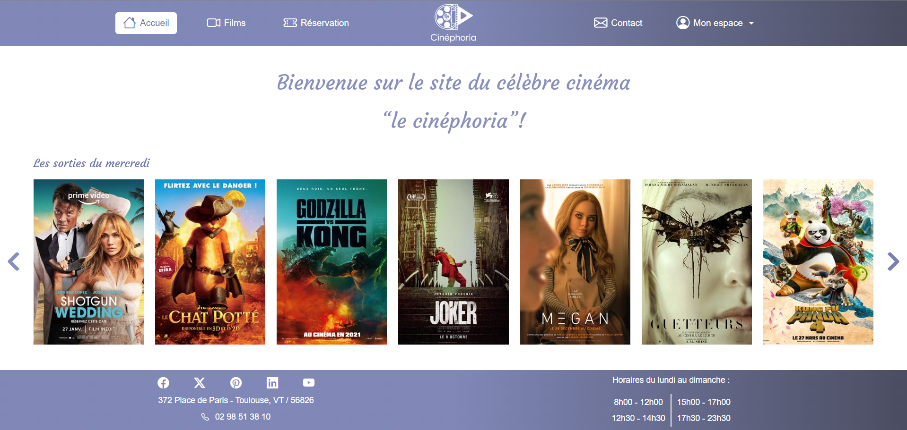

# Cinephoria_web

Application Symfony pour présenter les films du cinéma **"Le Cinéphoria"**.

- **Administrateur** : ajouter/supprimer des films et des séances, créer des comptes employés, modifier les mots de passe, afficher les statistiques (nombre de réservations par film sur 1 semaine).
- **Employé** : gérer des films et valider les avis.
- **Visiteur** : créer un compte, réserver en ligne, accéder à ses commandes une fois connecté.

Backend : Symfony (PHP 8.2)  
Frontend : HTML5, CSS, Bootstrap, JS (jQuery, Axios)  
Bases de données : MariaDB (SQL) + MongoDB (NoSQL)  
Déploiement local : **Docker**

Lien en ligne : https://cinephoria.joeldermont.fr

---

## Aperçu



---

## Prérequis

Avant de commencer, installez :

- [Docker Desktop](https://www.docker.com/products/docker-desktop/)
- [Git](https://git-scm.com/)

---

## Installation et Configuration

Clonez le dépôt :

```bash
git clone https://github.com/Joel-sudo-design/Cinephoria_web.git
cd Cinephoria_web
```

Construisez et lancez les conteneurs :

```bash
docker compose up -d --build
```

Le premier démarrage va :
- Installer les dépendances PHP (`composer install`) si besoin
- Créer et migrer la base MariaDB
- Installer les dépendances front (`yarn install`) et builder les assets

Importer les données SQL initiales via **phpMyAdmin** :  
http://localhost:8081
- hôte : `db`
- utilisateur : `symfony`
- mot de passe : `symfony`

Les données sont insérées en **une seule transaction** grâce au fichier `transaction.sql`.  
➡️ Les films auront automatiquement une **date de début fixée au dernier mercredi**.

---

## Utilisation

- Application : http://localhost
- phpMyAdmin (MariaDB) : http://localhost:8081
- Mongo Express : http://localhost:8082
- MailHog : http://localhost:8025

Logs applicatifs :
```bash
docker compose logs -f app
```

Accès au shell du conteneur Symfony :
```bash
docker compose exec app bash
```

Arrêter l’environnement :
```bash
docker compose down
```

---

## Auteur

Joël DERMONT  
Développeur principal - [Profil GitHub](https://github.com/Joel-sudo-design)
